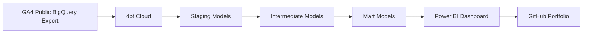

# GA4 E-commerce Analytics Pipeline

An end-to-end analytics engineering portfolio project using Google Analytics 4 ecommerce data, BigQuery, dbt Cloud, Power BI, and GitHub.

## Project Overview

This project transforms raw Google Analytics 4 ecommerce event data into clean, analytics-ready data models and a Power BI dashboard.

The main goal is to demonstrate how a modern analytics workflow can turn nested event-level web analytics data into business-facing insights such as conversion funnel performance, average order value, user behavior, and session-level ecommerce activity.

This is a portfolio project designed to showcase practical skills in:

- Analytics engineering
- Data modeling
- SQL transformation logic
- dbt project structure
- BigQuery
- Power BI dashboarding
- GitHub-based project documentation

## Business Problem

E-commerce teams need to understand how users move through the purchase journey.

Raw GA4 export data is highly detailed, but it is not directly business-friendly. It contains nested and repeated fields, event-level records, ecommerce objects, user properties, and item arrays.

This project answers questions such as:

- How many users reach each stage of the ecommerce funnel?
- Where do users drop off before purchasing?
- What is the average order value?
- How many sessions generate ecommerce activity?
- Which acquisition sources are associated with purchasing users?
- How can raw event data be modeled into facts and dimensions?

## Data Source

This project uses the public Google Analytics 4 ecommerce sample dataset available in BigQuery:

```text
bigquery-public-data.ga4_obfuscated_sample_ecommerce
```

The dataset contains obfuscated GA4 ecommerce event data and is suitable for analytics engineering practice, portfolio development, and dashboard prototyping.

## Target Architecture



## Tech Stack

| Layer | Tool | Purpose |
|---|---|---|
| Source Data | BigQuery Public Dataset | Native GA4 ecommerce export |
| Data Warehouse | Google BigQuery | Storage and SQL execution |
| Transformation | dbt Cloud | Data modeling, testing, documentation |
| BI / Dashboard | Power BI | Business-facing reporting |
| Version Control | GitHub | Portfolio repository and project history |
| Documentation | Markdown | README, architecture notes, data dictionary |

## Planned Data Model

The project follows a layered analytics engineering structure.

```text
Raw GA4 BigQuery export
        ↓
Staging layer
        ↓
Intermediate layer
        ↓
Marts layer
        ↓
Power BI semantic model
        ↓
Dashboard
```

### Staging Layer

The staging layer prepares raw GA4 event data for downstream modeling.

Planned models:

- `stg_ga4__events_base`
- `stg_ga4__event_params`
- `stg_ga4__user_properties`
- `stg_ga4__items`

Main responsibilities:

- Rename raw fields into clearer column names
- Parse event dates and timestamps
- Extract key event parameters
- Flatten repeated fields where needed
- Preserve event-level grain where appropriate

### Intermediate Layer

The intermediate layer applies business logic that should not live directly in final marts.

Planned models:

- `int_ga4__sessions`
- `int_ga4__user_journey_events`
- `int_ga4__funnel_events`

Main responsibilities:

- Build session-level logic
- Sequence user events
- Prepare funnel stages
- Calculate time between events
- Organize reusable transformation logic

### Marts Layer

The marts layer contains final business-facing models for Power BI.

Planned models:

- `fct_events`
- `fct_sessions`
- `dim_users`
- `fct_funnel_daily`

Main responsibilities:

- Provide clean facts and dimensions
- Support dashboard KPIs
- Enable Power BI reporting
- Create stable analytics outputs for business users

## Business KPIs

The final dashboard will focus on:

| KPI | Description |
|---|---|
| Conversion Funnel | Pageview → View Item → Add to Cart → Purchase |
| Drop-off Rate | Percentage of users lost between funnel stages |
| Average Order Value | Revenue divided by number of purchases |
| Purchase Conversion Rate | Percentage of sessions or users that result in purchase |
| Session Count | Number of ecommerce sessions |
| User Count | Number of unique users |
| Revenue | Total ecommerce purchase revenue |
| Add-to-Cart Rate | Share of product viewers who add items to cart |

## Repository Structure

```text
ga4-ecommerce-dbt-bigquery-powerbi/
│
├── README.md
│
├── dbt_ga4_ecommerce/
│   ├── models/
│   │   ├── staging/
│   │   │   └── ga4/
│   │   ├── intermediate/
│   │   │   └── ga4/
│   │   └── marts/
│   │       └── ecommerce/
│   │
│   ├── macros/
│   ├── seeds/
│   ├── tests/
│   ├── analyses/
│   │
│   ├── dbt_project.yml
│   └── packages.yml
│
├── docs/
│   ├── architecture.md
│   ├── data_dictionary.md
│   └── architecture_diagram.png
│
├── powerbi/
│   ├── ga4_ecommerce_dashboard.pbix
│   ├── screenshots/
│   └── exports/
│
└── screenshots/
    ├── dashboard_overview.png
    ├── funnel_analysis.png
    └── data_model.png
```

## Project Roadmap

| Sprint | Status | Goal |
|---|---:|---|
| Sprint 0 | In progress | Repository setup and documentation |
| Sprint 1 | Not started | dbt Cloud and BigQuery setup |
| Sprint 2 | Not started | GA4 source configuration |
| Sprint 3 | Not started | Staging models |
| Sprint 4 | Not started | Intermediate session and journey models |
| Sprint 5 | Not started | Mart models |
| Sprint 6 | Not started | dbt tests and documentation |
| Sprint 7 | Not started | Power BI dashboard |
| Sprint 8 | Not started | Portfolio polish and LinkedIn post |

## Current Status

The repository has been created and connected to a local development environment.

Current focus:

```text
Sprint 0 — Project setup and portfolio documentation
```

Completed:

- GitHub repository created
- Repository cloned locally
- Initial folder structure created
- README drafted

Next steps:

- Create dbt Cloud account
- Connect dbt Cloud to GitHub
- Configure BigQuery access
- Initialize dbt project inside `dbt_ga4_ecommerce/`

## Author

Ricardo Morgado

Analytics Engineer, focused on data modeling, Power BI, SQL, and modern data stack practices.